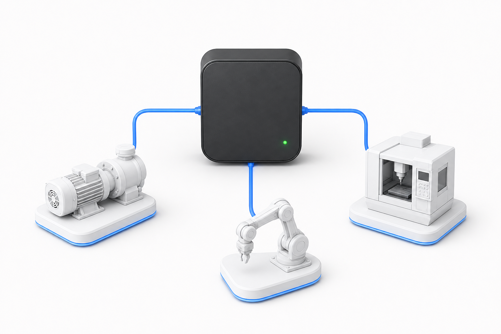

# cmdop-care

<p align="center">
  
</p>

A small, read-only [Model Context Protocol](https://modelcontextprotocol.io)
(MCP) stdio server exposing **4 read-only tools** over an already-enrolled
[cmdop](https://cmdop.com) machine fleet: roster visibility, machine health,
one bounded live diagnostic, and cmdop-owned storage usage.

**Published:** [`io.github.commandoperator/cmdop-care`](https://registry.modelcontextprotocol.io/?q=io.github.commandoperator%2Fcmdop-care)
· **Current version:** `v0.1.2` · **License:** Apache-2.0

If you already use cmdop on a machine, this is the conservative MCP entry
point: connect an MCP-aware assistant to read fleet health without exposing a
shell, arbitrary file reads, or open-ended machine delegation. The host must
already be enrolled; credentials stay in the host operating system keyring.
For broader machine operations, use the main cmdop MCP server instead.

This is **not** the full cmdop MCP surface. It intentionally omits
`ask_machine`, `run_command`, `read_file`, and `list_dir` — every tool that
executes a command, reads an arbitrary file, or delegates an open-ended task
to another machine. If you need those, use the main `cmdop` CLI's own MCP
server (`cmdop mcp stdio`), which is a separate, broader, product-integration
surface with its own review requirements. `cmdop-care` exists specifically to
offer a narrower, safer, publishable subset for the official MCP Registry.

## Requirement: an already-enrolled `cmdop` CLI on the host

**`cmdop-care` requires the host machine to already be enrolled via the main
cmdop CLI.** It does not implement enrollment itself, and it does not accept a
relay token via an environment variable or a mounted secret as a primary
credential path. On startup it reads:

- the relay OAuth/enrollment Bearer token the `cmdop` CLI already stored in
  the OS keyring (macOS Keychain / Linux Secret Service / Windows Credential
  Manager) when you ran `cmdop join <join-key>`;
- any per-machine connection PIN the `cmdop` CLI has already cached in the
  same keyring (e.g. from a prior `cmdop connect`), for `care_diagnose` only.

If no token is found, every tool responds with a clear "not enrolled" message
instead of failing silently or hanging.

This "host-keyring passthrough" model was a deliberate design decision (see
`security-architecture-2026-07-18.md` in this artifact's source repository)
to avoid introducing a second, weaker credential-handling path for the
product — this binary is not a fully standalone identity; it rides the same
enrollment as the CLI already installed on the host.

## The 4 tools

### `list_machines`

Lists the machines in the enrolled fleet.

- **Input:** none.
- **Output:** an array of `{host, online, os}`. **No machine ID/UUID is ever
  returned** — this is a deliberate redaction decision (the internal relay
  identifier is dropped before serialization, not merely omitted from
  rendering).

### `care_status`

Reads the durable Machine Care projection (facts, findings, coverage,
freshness) for one enrolled machine.

- **Input:** `machine` (string, required) — exact display name from
  `list_machines`.
- **Output:** aggregate facts/findings with closed-vocabulary codes, coverage
  flags, and reason codes. No raw paths, commands, environment variables, or
  machine identity.
- Read-only; works even while the target machine is offline (it reads a
  relay-stored projection, not a live round-trip).

### `care_diagnose`

Runs one bounded, typed process/startup diagnostic on a **live** enrolled
machine — useful for "why is this machine slow?"

- **Input:** `machine` (string, required).
- **Output:** a bounded snapshot of process and startup-item facts.

**Two disclosures, read before using this tool:**

1. **PIN forwarding.** If the target machine requires a connection PIN, it is
   forwarded **automatically** from this host's local OS-keyring PIN cache.
   You cannot and do not need to pass a PIN as a tool argument. If the
   machine requires a PIN and none is cached on this host, the call **fails
   closed** with a permission error — it never proceeds without one.
2. **Process data reaches your LLM provider.** The response includes **raw
   OS process IDs (PIDs) and process names** from the target machine. That
   means whatever MCP client and LLM you are using — Claude Code, Codex, or
   any other MCP-speaking assistant — will see the names of processes
   running on that machine. This is a deliberate, reviewed part of the
   diagnostic contract (it is bounded: at most 20 process entries, no
   command lines, no arguments, no environment variables, no file paths),
   but you should know it before enabling this tool on a machine whose
   process list you don't want an external LLM provider to see.

It never executes a shell command, accepts no PID or command argument, and
performs no mutation.

### `care_storage_inventory`

Reads the latest validated cmdop-owned storage inventory for one enrolled
machine.

- **Input:** `machine` (string, required).
- **Output:** aggregate byte totals per closed-vocabulary storage source
  (e.g. `cmdop_logs`, `devcache_go_build`). Accepts no path argument and
  deletes nothing.

## What every tool call does *not* do

- No tool accepts a shell command, a file path, or a raw PID as an argument.
- The only free-form input across all 4 tools is the `machine` string, used
  purely as an opaque lookup key resolved server-side against your own
  fleet — never interpolated into a path, command, or query.
- Every call is wrapped in a 15-second timeout independent of the relay's own
  transport defaults, and a small per-tool rate limit, so a stuck or abused
  backend cannot hang the process or become a high-volume exfiltration
  channel.

## Build and run

```bash
go build -o cmdop-care .
./cmdop-care
```

Or via Docker (after resolving and pinning the base image digest — see the
`<PIN-BEFORE-BUILD>` comment in `Dockerfile`):

```bash
docker build -t cmdop-care:0.1.2 .
docker run --rm -i cmdop-care:0.1.2
```

The server speaks MCP over stdio only — there is no listening port. Point
your MCP client (Claude Code, Codex, or any other MCP-speaking assistant) at
the built binary or image the way you would any other stdio MCP server.

For AI-client setup notes, including a minimal MCP JSON configuration and first
prompt, see [`llms-install.md`](llms-install.md).

For marketplace submissions that require a square logo image, use the canonical
400×400 PNG in [`assets/cmdop-care-400.png`](assets/cmdop-care-400.png).

## Releasing a new version

Maintainers: see [`RELEASE.md`](RELEASE.md) — the short version is `make
publish`, always run manually, never triggered by any CI or by `cmdop_go`'s
own release.

## Relay address

By default `cmdop-care` dials the local embedded cmdop relay on loopback
(`127.0.0.1:63142`). Set `CMDOP_CARE_RELAY_ADDR` to override the dial target
for advanced self-hosted setups. This is a transport address only — never a
credential.

## Compatibility

| `cmdop-care` version | Compatible cmdop relay wire contract |
|---|---|
| `v0.1.2` | `AiAgentService.GetMachineCare` / `RunMachineCareDiagnostic` / roster-list shape as of 2026-07-18 |

## Contributing to this repository

This repository enables a tracked pre-commit hook that rejects staged
environment files, private keys, and probable API tokens. After cloning, run:

```bash
git config core.hooksPath .githooks
```

## Security

This artifact went through an explicit threat-model and code-audit review
before implementation (see the Cmdop organization's internal
`security-architecture-2026-07-18.md` and `code-audit-2026-07-18.md`, referenced
from this repository's delivery track). Report a security issue privately to
**security@cmdop.com** — see [SECURITY.md](SECURITY.md) for what to include and
what to expect.

## License

Apache-2.0 — see [LICENSE](LICENSE).
